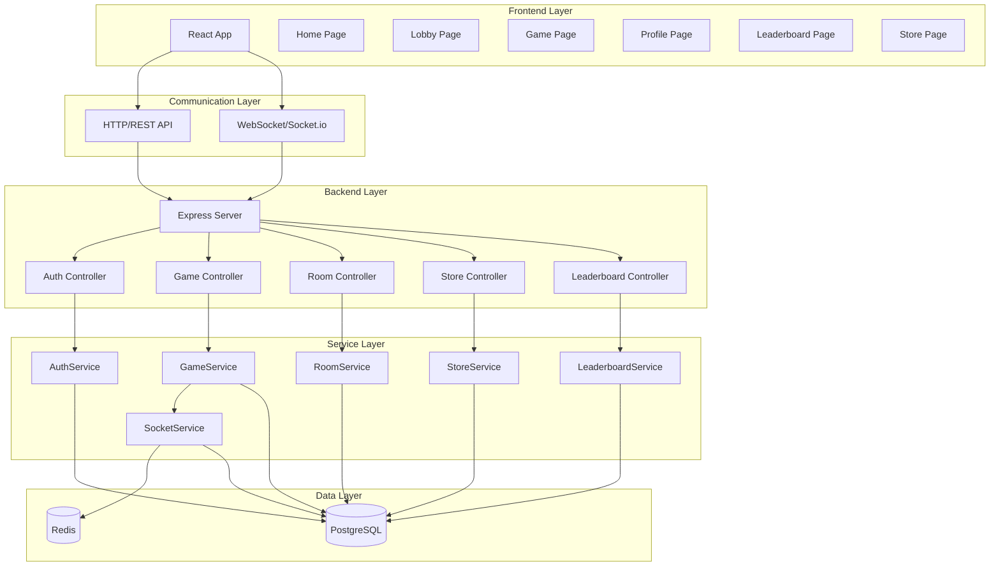
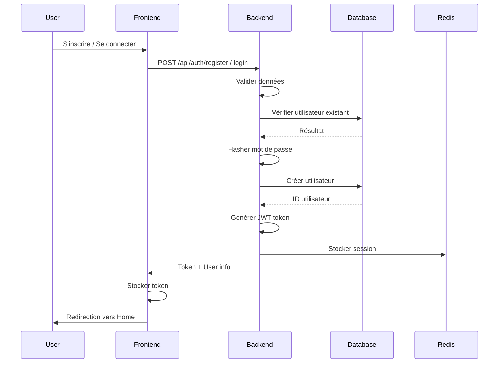
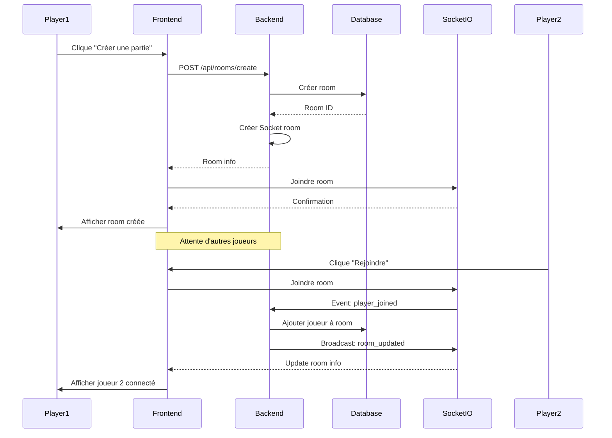
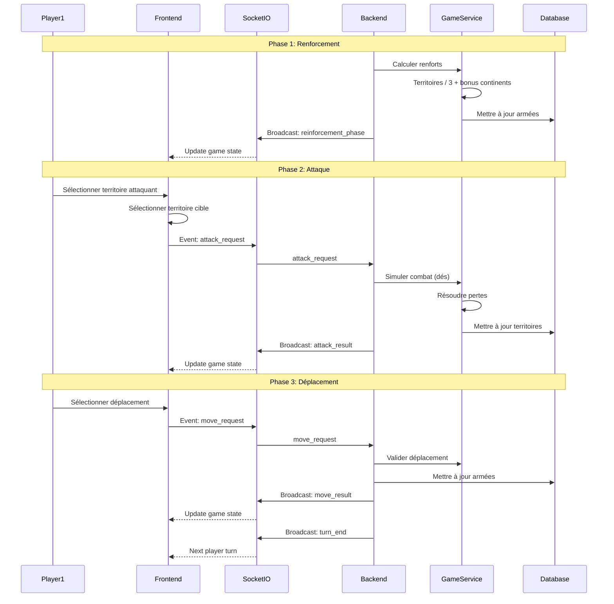
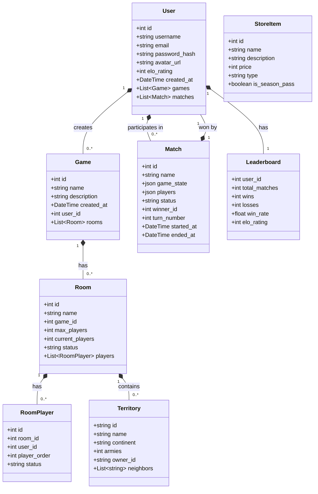
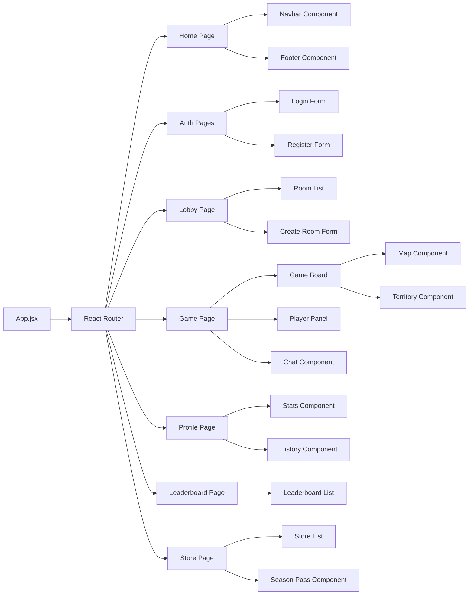
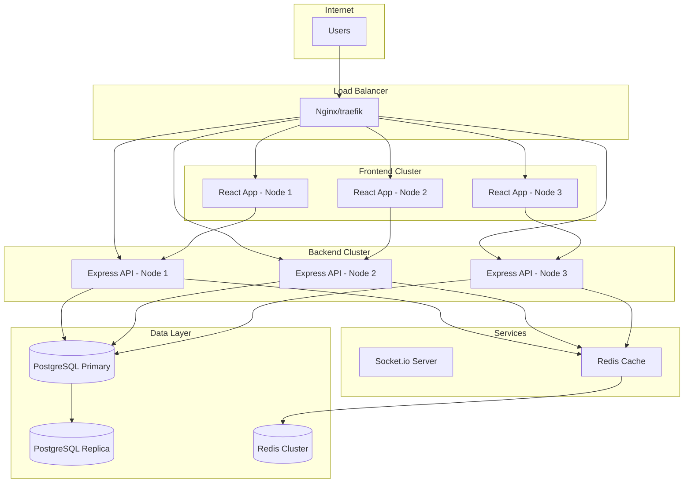

# Architecture Système - Risiko! Game Board Strategy

## Diagramme d'Architecture Global



## Diagramme de Séquence - Authentification



## Diagramme de Séquence - Création de Partie



## Diagramme de Séquence - Tour de Jeu



## Diagramme de Classe - Modèles de Données



## Diagramme de Composants - Frontend



## Diagramme de Déploiement



## Schéma de Base de Données

```mermaid
erDiagram
    USERS ||--o{ GAMES : creates
    USERS ||--o{ MATCHES : participates_in
    USERS ||--o{ MATCH_HISTORY : has
    USERS ||--|| LEADERBOARD : has
    GAMES ||--o{ ROOMS : creates
    ROOMS ||--o{ ROOM_PLAYERS : contains
    ROOM_PLAYERS }o--|| USERS : player
    MATCHES ||--o{ MATCH_HISTORY : has
    MATCHES }o--|| USERS : won_by
    STORE_ITEMS ||--o{ PURCHASES : sold_in
    PURCHASES }o--|| USERS : purchased_by
    SEASON_PASSES ||--o{ SUBSCRIPTIONS : offered_in
    SUBSCRIPTIONS }o--|| USERS : subscribed_by

    USERS {
        int id PK
        string username UK
        string email UK
        string password_hash
        string avatar_url
        int elo_rating
        datetime created_at
        datetime updated_at
    }

    GAMES {
        int id PK
        string name
        string description
        datetime created_at
        int user_id FK
    }

    ROOMS {
        int id PK
        string name
        int game_id FK
        int max_players
        int current_players
        string status
        datetime created_at
    }

    ROOM_PLAYERS {
        int id PK
        int room_id FK
        int user_id FK
        int player_order
        string status
        datetime joined_at
    }

    MATCHES {
        int id PK
        string name
        json game_state
        json players
        string status
        int winner_id FK
        int turn_number
        datetime started_at
        datetime ended_at
    }

    MATCH_HISTORY {
        int id PK
        int match_id FK
        int player_id FK
        string result
        int elo_change
        datetime played_at
    }

    LEADERBOARD {
        int user_id PK FK
        int total_matches
        int wins
        int losses
        int draws
        float win_rate
        int elo_rating
        datetime last_updated
    }

    STORE_ITEMS {
        int id PK
        string name
        string description
        int price
        string type
        boolean is_season_pass
        string image_url
        datetime created_at
    }

    PURCHASES {
        int id PK
        int user_id FK
        int item_id FK
        int quantity
        int total_price
        datetime purchased_at
    }

    SEASON_PASSES {
        int id PK
        string name
        string description
        int price
        int duration_days
        json benefits
        datetime created_at
    }

    SUBSCRIPTIONS {
        int id PK
        int user_id FK
        int season_pass_id FK
        datetime started_at
        datetime ended_at
        boolean is_active
    }
```

## Conclusion

Cette architecture fournit une base solide pour le jeu Risiko! avec:
- Scalabilité horizontale possible
- Séparation claire des responsabilités
- Communication en temps réel via WebSocket
- Persistance des données avec PostgreSQL
- Cache avec Redis pour performances
- Design responsive et moderne
